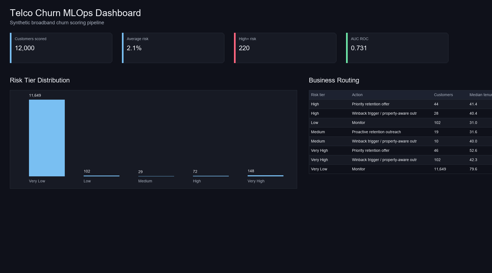
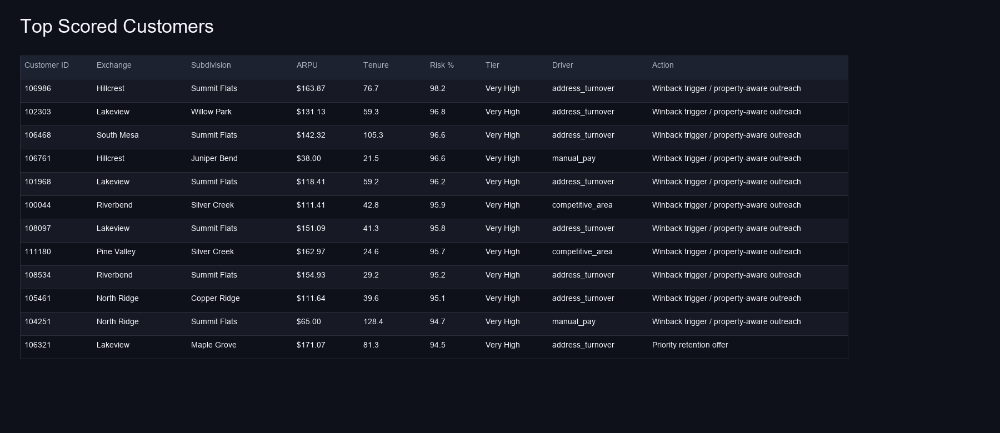
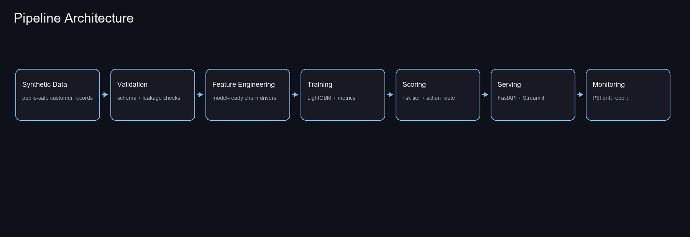
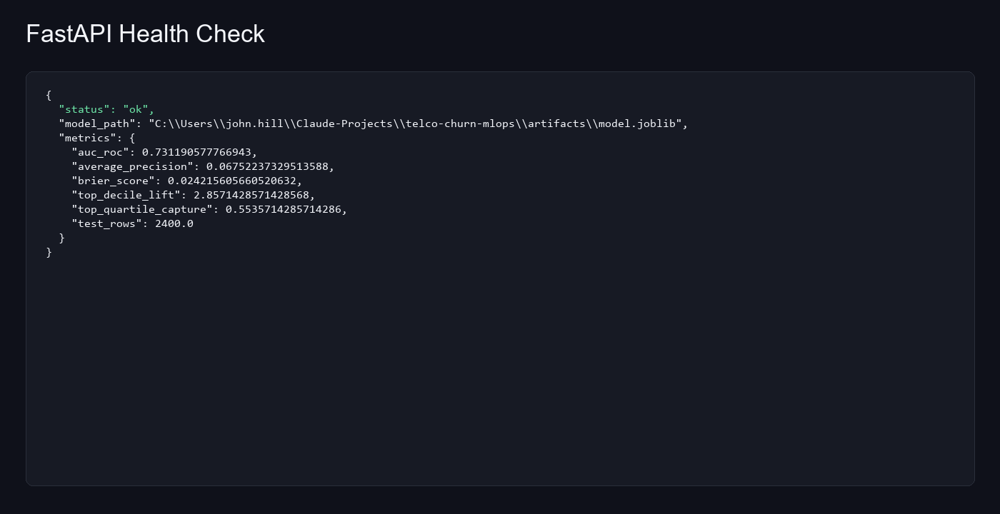
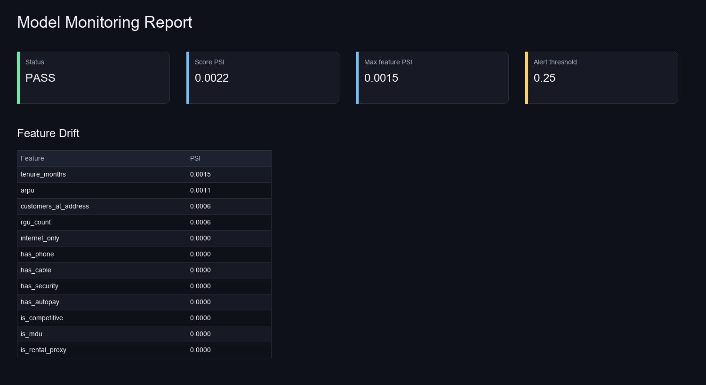

# Telco Churn MLOps

A portfolio-ready MLOps pipeline for broadband churn prediction. The project uses synthetic telco customer data so it can be published safely while still demonstrating a realistic machine learning workflow: data generation, validation, training, experiment tracking, batch scoring, API serving, drift monitoring, and an executive dashboard.

## Demo







The project runs locally with a FastAPI service and Streamlit dashboard:

```powershell
.\scripts\run.ps1 all
.\scripts\run.ps1 api
.\scripts\run.ps1 dashboard
```

Additional implementation screenshots:





## What It Demonstrates

- Synthetic broadband customer dataset with churn drivers such as tenure, ARPU, bundle depth, autopay, competition, MDU status, and address turnover.
- Data validation and leakage checks before training.
- LightGBM churn model with lift, calibration, AUC, and average precision metrics.
- Local MLflow logging when MLflow is installed, with a JSON fallback when it is not.
- Customer-level risk scoring with tier, top risk driver, and recommended action.
- FastAPI service for real-time and batch prediction.
- Streamlit dashboard for portfolio demo.
- Drift monitoring with Population Stability Index.
- Pytest and GitHub Actions CI.

## Quickstart

```powershell
cd C:\Users\john.hill\Claude-Projects\telco-churn-mlops
python -m pip install -r requirements.txt
.\scripts\run.ps1 all
```

On macOS/Linux with `make`:

```bash
pip install -r requirements.txt
make all
```

Start the API:

```powershell
.\scripts\run.ps1 api
```

Start the dashboard:

```powershell
.\scripts\run.ps1 dashboard
```

The API defaults to `http://127.0.0.1:8000`. Streamlit prints the dashboard URL when it starts.

## Pipeline Commands

| Command | Purpose |
|---|---|
| `data` | Generate synthetic raw and processed customer data |
| `validate` | Run schema, range, and leakage checks |
| `train` | Train LightGBM and write model + metrics artifacts |
| `score` | Score all customers and write `artifacts/scored_customers.csv` |
| `monitor` | Generate drift summary and HTML report |
| `api` | Run FastAPI on `127.0.0.1:8000` |
| `dashboard` | Run Streamlit dashboard |
| `test` | Run pytest |
| `all` | Run data, validate, train, score, monitor, and tests |

## API

After `score` or `all`, run:

```powershell
.\scripts\run.ps1 api
```

Endpoints:

- `GET /health`
- `POST /predict`
- `POST /batch-predict`

Example payload:

```json
{
  "customer_id": 100001,
  "customer_type": "Residential",
  "exchange": "North Ridge",
  "subdivision": "Maple Grove",
  "tenure_months": 8,
  "arpu": 79.5,
  "rgu_count": 1,
  "has_internet": 1,
  "has_phone": 0,
  "has_cable": 0,
  "has_security": 0,
  "has_autopay": 0,
  "is_competitive": 1,
  "is_mdu": 0,
  "customers_at_address": 2,
  "churned": 0
}
```

## Portfolio Note

The data is synthetic. The model and pipeline are designed around common broadband churn patterns, not private customer records. This makes the repo safe to publish while keeping the business workflow realistic.
